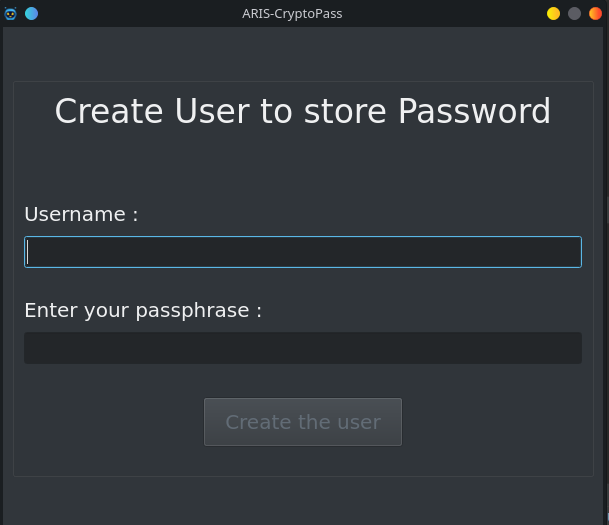
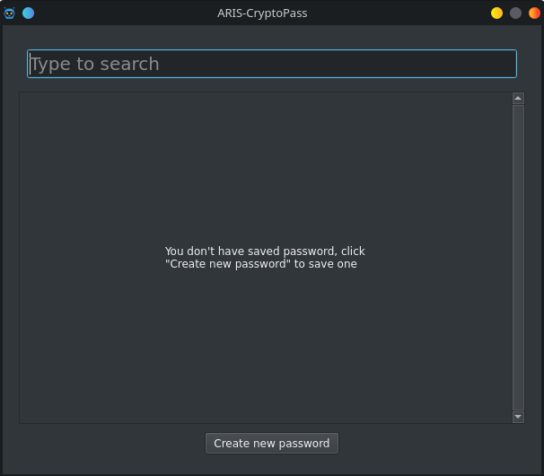
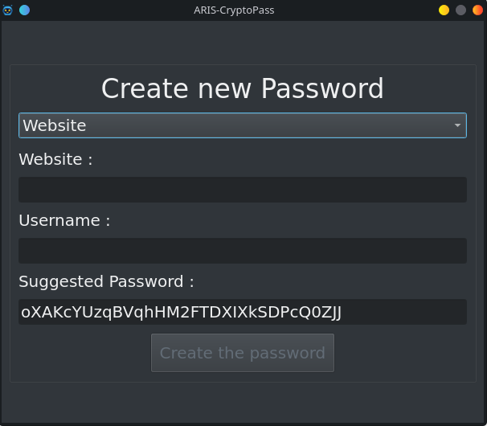
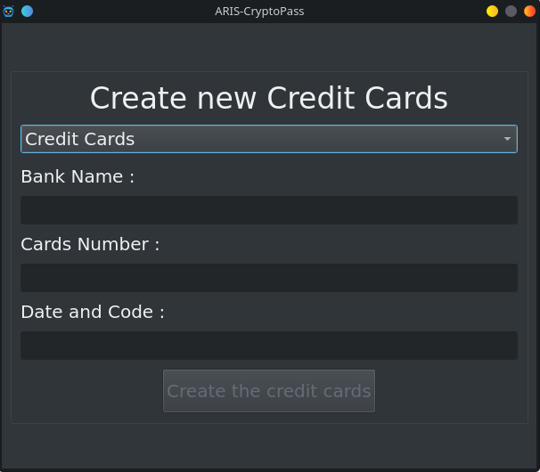
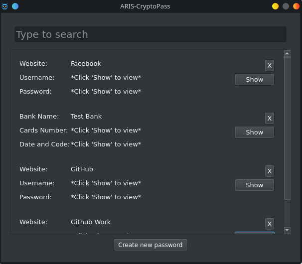
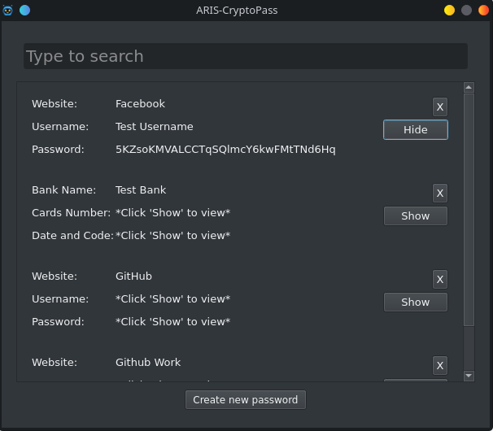
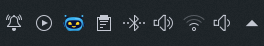
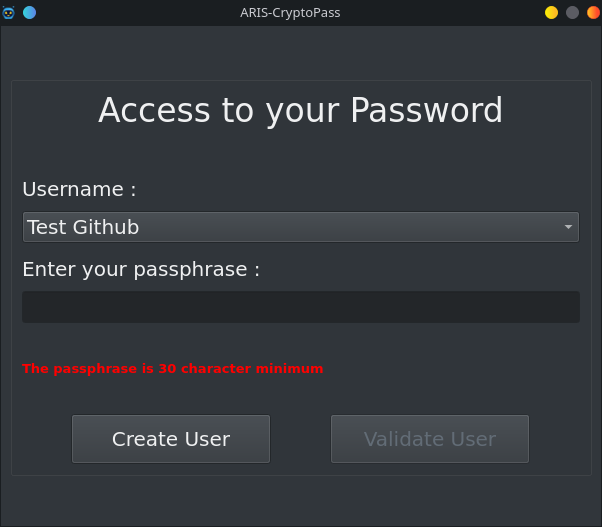

# ARIS-CryptoPass

ARIS-CryptoPass is a little software to save Password and Credit Cards, connection free, highly secure with your own passphrase.
The encrypted file will be save on your desktop, no cloud saving ! 
When saving Password you can use the very strong suggested password :wink:

# Table of contents

- [Usage](#usage)
- [Installation](#installation)

 # Usage

[(Back to top)](#table-of-contents)

- Launch ARIS-CryptoPass and create user, you should use a very strong passphrase and never forget it : 
  

- The Password Screen, on the top you have an input to search in the password list : 
  

- Click on Create new password to save new password or credit cards :
  
  

- How to fill the Create Password Screen : 
  1) Fill the Website input with name of the Website ("Github", "Gmail", "Youtube", ...)
  2) Fill the Username input with the username
  3) You can use the Suggested Password or enter your own password
  
- How to fill the Create Credit Cards Screen : 
  1) Fill the Bank Name input with name of the Bank
  2) Fill the Cards Number input with the number of the cards
  3) Fill the Date and code input with the expiration date and code of the cards ("xx/xx xxx") 

- Password and Credit Cards screen :
  
  
  1) You can use the "Show" button to show the username and password and "Hide" to hide it
    
  2) You can use the X to delete a saved password or credit cards

- When you reduce or close ARIS-CryptoPass you will have it on your System Tray (little robot head)
  
  
  1) Left-Click on the robot head => reopen ARIS-CryptoPass
  2) Right-Click on the robot head => open menu and select close to close ARIS-CryptoPass

- When you relaunch ARIS-CryptoPass after saving : 
   

# Installation

[(Back to top)](#table-of-contents)
